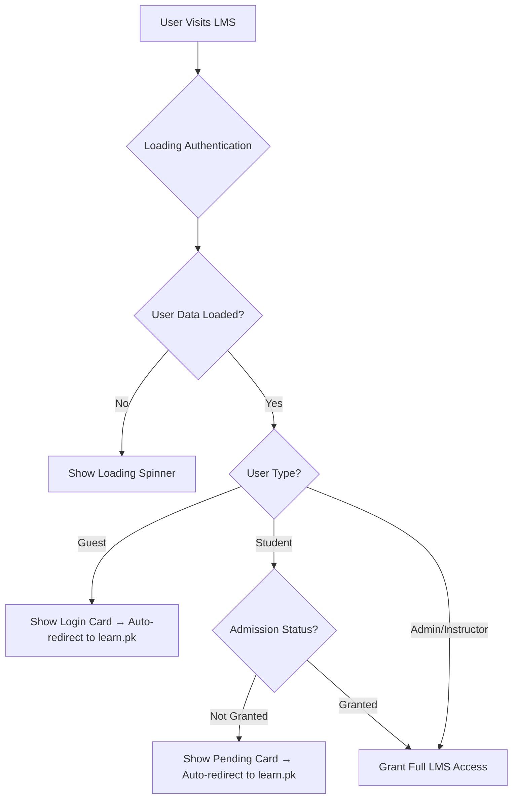

# Learn LMS

A comprehensive Learning Management System built with React and Redux Toolkit, featuring advanced authentication and admission control.

## Overview

Learn LMS is a modern, feature-rich learning management system designed to facilitate online education and course delivery. The platform provides tools for instructors to manage courses, lectures, and announcements, while offering students an intuitive interface to access learning materials with robust admission status verification.

## Recent Updates (October 2025)

### 🔐 Enhanced Authentication & Admission Control
- **Admission Status Verification**: Students must have `admission_status: 'Granted'` to access the LMS
- **Auto-redirect**: Unauthorized users are automatically redirected to learn.pk after countdown
- **Beautiful Access Control Cards**: Modern UI for pending verification and login prompts
- **Double-layer Security**: Multiple authentication checks prevent unauthorized access

### 🎥 YouTube Live Integration  
- **Live Lecture Support**: Full support for YouTube live stream URLs
- **16:9 Aspect Ratio**: Automatic thumbnail aspect ratio enforcement
- **Enhanced URL Parsing**: Supports all YouTube URL formats including live streams

### 🎨 UI/UX Improvements
- **Mobile-responsive Notifications**: Fixed notification popup positioning on mobile devices
- **Date Field Removal**: Cleaned up unnecessary date displays across components
- **Modern Card Designs**: Beautiful gradient backgrounds and professional styling

### ⚡ Performance & Restrictions
- **Removed Date Restrictions**: Disabled batch-specific date limitations for lecture scheduling
- **Redux Architecture**: Migrated to Redux Toolkit for better state management
- **Optimized Loading States**: Improved authentication flow with proper loading indicators

## Features

- **Advanced Role-based Access Control**: Multi-layer authentication with admission status verification
- **Batch Management**: Courses organized by batches with flexible lecture scheduling
- **Live Lecture Integration**: Full YouTube live stream support with automatic thumbnail generation
- **Admission Status Control**: Students require verified admission status to access content
- **Auto-redirect Security**: Unauthorized users are guided back to the main site
- **Responsive Design**: Built with Tailwind CSS for modern, mobile-friendly interface
- **Redux State Management**: Centralized state with Redux Toolkit
- **Real-time Notifications**: Toast notifications for user feedback
- **Beautiful Access Cards**: Professional UI for different access states

## Technologies Used

- **Frontend**: React 19, Redux Toolkit, React Router v6
- **Styling**: Tailwind CSS 4 with responsive design
- **Build Tool**: Vite 7 with optimized development experience
- **Backend**: Express.js with RESTful API design
- **HTTP Client**: Axios for API requests
- **Forms**: React Hook Form for efficient form management
- **UI Feedback**: React Hot Toast for user notifications
- **Icons**: React Icons for consistent iconography
- **Authentication**: WordPress REST API integration
- **Development**: Concurrently for running multiple services

## Getting Started

### Prerequisites

- Node.js 18.x or higher
- npm 9.x or higher

### Installation

1. Clone the repository:
   ```
   git clone https://github.com/mahmedraza1/Learn-LMS.git
   cd Learn-LMS
   ```

2. Install all dependencies (frontend and backend):
   ```
   ./setup.sh
   ```
   
   Or manually:
   ```
   npm install                        # Install frontend dependencies
   cd server && npm install && cd ..  # Install backend dependencies
   ```

3. Start both frontend and backend:
   ```
   npm run dev:all
   ```
   
   Or start them separately:
   ```
   # Terminal 1 - Frontend
   npm run dev
   
   # Terminal 2 - Backend
   npm run server
   ```

4. Access the frontend at [https://lectures.learn.pk:5173](https://lectures.learn.pk:5173)
5. Backend API runs at:
   - Production: [https://lms.learn.pk/learnlive](https://lms.learn.pk/learnlive)
   - Development: [http://localhost:3001/learnlive](http://localhost:3001/learnlive)

### Production Mode

To build the frontend and serve it from the backend:

```
npm run start
```

This will:
1. Build the frontend into the `dist` folder
2. Start the Express server which will serve both:
   - API endpoints at `/learnlive/*`
   - Frontend static files from the `dist` directory

Access the complete application at:
- Production: [https://lms.learn.pk](https://lms.learn.pk)
- Development: [http://localhost:3001](http://localhost:3001)

## Project Structure

- `src/components/` - Reusable UI components
- `src/contexts/` - React context providers for state management
- `src/pages/` - Page components for different user roles
- `src/utils/` - Utility functions and helpers
- `server/` - Express.js backend API
- `server/data/` - JSON data storage files

## User Roles & Access Control

### 🚫 Guest Users
- **Access**: Denied - shown beautiful login prompt card
- **UI**: Modern gradient design with Learn.pk branding
- **Auto-redirect**: Redirected to learn.pk after 10 seconds
- **Action**: Must log in at learn.pk to continue

### ⏳ Students (Pending Verification)
- **Access**: Denied - shown verification pending card
- **Requirement**: Must have `admission_status: 'Granted'`
- **UI**: Professional yellow-themed card with contact information
- **Auto-redirect**: Redirected to learn.pk after 15 seconds
- **Timeline**: Up to 24 hours for admission approval

### ✅ Students (Verified)
- **Access**: Full LMS access after admission verification
- **Features**: 
  - Course dashboard for assigned batch
  - Live lecture access with YouTube integration
  - Notes, announcements, and course materials
  - Mobile-responsive interface

### 👨‍🏫 Instructor/Admin
- **Access**: Full administrative control
- **Features**:
  - Access to all batches and courses
  - Create/edit/delete lectures with YouTube live support
  - Manage announcements and course content
  - Student admission status management
  - Advanced lecture scheduling without date restrictions

## Authentication Flow



## Security Features

### 🛡️ Multi-Layer Authentication
1. **Initial Loading Check**: Prevents access during authentication
2. **User Data Validation**: Ensures user object is properly loaded
3. **Role Verification**: Validates user roles from WordPress API
4. **Admission Status Check**: Double-layer verification for students
5. **Auto-redirect Safety**: Guides unauthorized users to main site

### 🔒 Admission Status Control
- **Primary Barrier**: Students without `admission_status: 'Granted'` cannot access any LMS content
- **Real-time Verification**: Status checked on every page load
- **WordPress Integration**: Synced with learn.pk user database
- **Bypass Prevention**: Multiple redundant checks prevent unauthorized access

## Backend API Endpoints

### Authentication & User Management
- `GET /wp-json/custom/v1/me` - Get current user data with admission status
- **WordPress Integration**: Handles user authentication and role management

### Lecture Management
- `GET /api/lectures` - Get all lectures
- `GET /api/lectures/:batch` - Get lectures for a specific batch
- `GET /api/lectures/:batch/:courseId` - Get lectures for a specific course in a batch
- `POST /api/lectures/:batch/:courseId` - Create or update a lecture
- `DELETE /api/lectures/:batch/:courseId/:lectureId` - Delete a lecture

### YouTube Integration
- **Live Stream Support**: Full support for YouTube live URLs
- **Thumbnail Generation**: Automatic 16:9 aspect ratio thumbnails
- **URL Parsing**: Handles all YouTube URL formats including:
  - `youtube.com/watch?v=VIDEO_ID`
  - `youtu.be/VIDEO_ID`
  - `youtube.com/live/VIDEO_ID`
  - `youtube.com/embed/VIDEO_ID`

### Announcement System
- `GET /api/announcements/:batch` - Get batch-specific announcements
- `GET /api/global-announcements` - Get global announcements
- `POST /api/announcements` - Create new announcements

## Data Structure

### User Authentication Response
```json
{
  "id": 12345,
  "username": "student123",
  "roles": ["student"],
  "admission_status": "Granted",
  "batch": "Batch A",
  "display_name": "John Doe",
  "email": "john@example.com"
}
```

### Lecture Data Structure
```json
{
  "Batch A": {
    "course_id_1": [
      {
        "id": 1234567890,
        "course_id": "course_id_1",
        "title": "Introduction to React",
        "youtube_url": "https://youtube.com/live/VIDEO_ID",
        "youtube_id": "VIDEO_ID",
        "lecture_number": 1,
        "date": "2025-10-01T00:00:00.000Z",
        "is_live": true,
        "thumbnail_url": "https://img.youtube.com/vi/VIDEO_ID/maxresdefault.jpg"
      }
    ]
  }
}
```

## Component Architecture

### 🔐 Authentication Components
- **AuthWrapper**: Main authentication controller with multi-layer security
- **GuestView**: Beautiful login prompt with auto-redirect
- **StudentPendingView**: Verification pending card with contact information

### 🎥 Media Components  
- **LectureCard**: YouTube integration with live stream support and 16:9 thumbnails
- **VideoPlayerModal**: Enhanced video player with responsive design
- **LiveClassAnnouncement**: Real-time live lecture notifications

### 🎨 UI Components
- **NotificationPopup**: Mobile-responsive notification system
- **CourseCard**: Course display with modern card design
- **DashboardStats**: Analytics and progress tracking

## Development Notes

### 🔧 Recent Fixes & Improvements

#### Authentication Security Enhancements
- **Race Condition Fix**: Added explicit `user === null` check during authentication
- **Double-layer Protection**: Multiple redundant checks for student admission status
- **Debug Logging**: Console logging for authentication state debugging
- **Improved Selectors**: Strengthened Redux selectors with explicit boolean returns

#### YouTube Integration Improvements
- **Live URL Support**: Enhanced `getThumbnailUrl()` function for live streams
- **Aspect Ratio Enforcement**: All video thumbnails now use 16:9 aspect ratio
- **URL Pattern Recognition**: Supports all YouTube URL variations

#### Mobile Responsiveness
- **Fixed Notification Positioning**: Resolved mobile notification popup overflow
- **Responsive Cards**: All access control cards work perfectly on mobile devices
- **Touch-friendly UI**: Optimized button sizes and interactions for mobile

#### Performance Optimizations
- **Removed Date Restrictions**: Eliminated batch-specific date limitations
- **Streamlined Loading**: Improved authentication flow with better loading states
- **Component Cleanup**: Removed unnecessary date display logic from multiple components

### 🚀 Configuration

#### Development Environment
- **Hot Reload**: Vite provides instant feedback during development
- **HTTPS Support**: Optional SSL configuration for production-like testing
- **Proxy Setup**: Backend API proxying for seamless development

#### Production Deployment
- **Build Optimization**: Vite builds optimized production bundles
- **Static Serving**: Express serves built frontend from `/dist`
- **API Integration**: Unified deployment with backend API routes

### 🔍 Debugging

To debug authentication issues:

1. **Check Console Logs**: AuthWrapper logs all authentication state
2. **Verify API Response**: Check `/wp-json/custom/v1/me` endpoint
3. **Admission Status**: Ensure `admission_status` field is `'Granted'`
4. **Role Verification**: Confirm user has correct roles in WordPress

Example debug output:
```javascript
AuthWrapper Debug: {
  user: { id: 123, roles: ['student'], admission_status: 'Granted' },
  isAdmin: false,
  isStudent: true,
  isGuest: false,
  hasGrantedAdmission: true,
  loading: false,
  admission_status: 'Granted'
}
```

## Contributing

1. Fork the repository
2. Create a feature branch: `git checkout -b feature/amazing-feature`
3. Commit changes: `git commit -m 'Add amazing feature'`
4. Push to branch: `git push origin feature/amazing-feature`
5. Open a Pull Request

## License

This project is licensed under the MIT License - see the LICENSE file for details.

## Support

For support and inquiries:
- 📧 Email: [contact@learn.pk](mailto:contact@learn.pk)
- 📱 WhatsApp: [+923177569038](https://wa.me/923177569038)
- 🌐 Website: [learn.pk](https://learn.pk)
